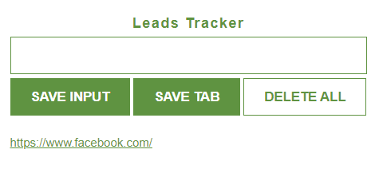

# Leads Tracker

__This project is a simple lead tracker web application built with HTML, CSS, and JavaScript. The app allows users to save and manage URLs of websites they want to keep track of and also to take quick notes for later use. Users can add URLs manually through an input field or automatically save the current browser tab's URL. The app also provides functionality to clear all saved leads.__

## Features
- __Add Leads Manually__: Users can type a URL or take a quick note into an input field and click a button to save it.
- __Add Leads Automatically__: Users can click a button to save the URL of the current browser tab.
- __View Leads__: Saved URLs are displayed as a list of clickable links.
- __Delete Leads__: Users can clear all saved URLs with a double-click on the delete button.
- __Persistent Storage__: Saved URLs are stored in the browser's local storage, allowing them to persist between sessions.

## Interface

## Installation
1. Clone the repository: `git clone https://github.com/omkeshri/leads-tracker-extension.git`
2. Open the `index.html` file in your browser to use the app.

## Usage
1. Type a URL into the input field or a quick note and click "Save Input" to add it to the list.
2. Click "Save Tab" to add the current browser tab's URL to the list.
3. Double-click the "Delete All" button to clear all saved URLs.

## Contributing
Feel free to fork this repository and contribute by submitting a pull request. For major changes, please open an issue first to discuss what you would like to change.

